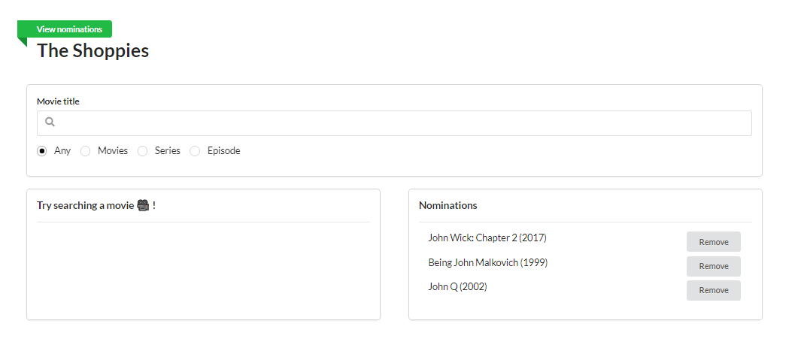
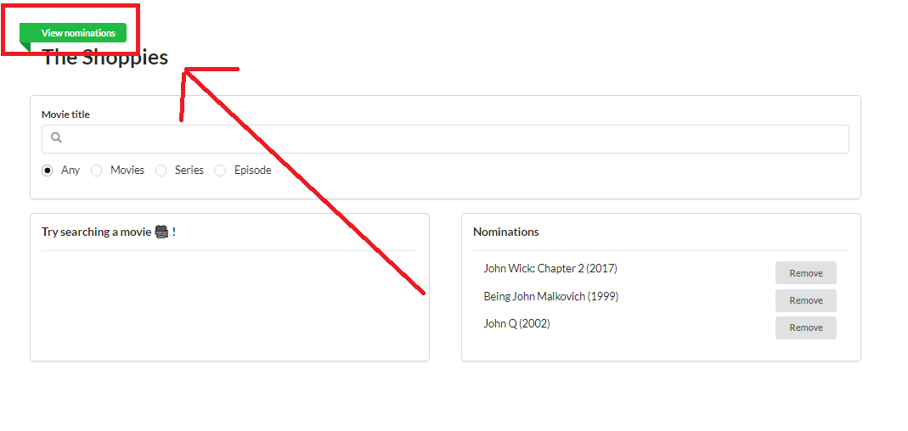
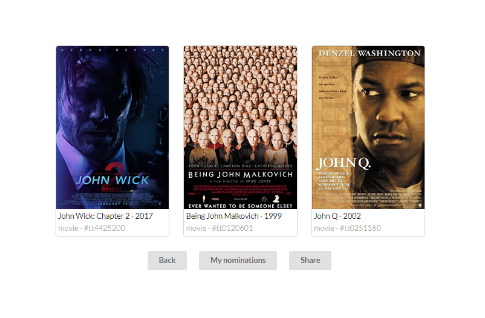

# The Shoppies 🎥

Front-end challenge for Shopify's Internship (Fall 2021)

Deployed here 👉 [The Shoppies](https://shopify-webdev-challenge.herokuapp.com/) via Heroku

## Presentation 💡

#### Home page

Where you can search and nominate movies


#### Pretty nominations view

Acces to the pretty view for nominations


#### Nominations and share

View and share nominations


---

# Run locally

```sh
git clone https://github.com/guillaumegtr/react-app-boiler.git

npm install

npm run start
```

---

# Features 👌

I decided to build the following project using React Typescript and Redux ⚛. This is the web front-end framework that I have the most experience with.

**Simple and clean design is what I aimed for concerning UI/UX** 🧼

### Implemented features

- Search OMDB and display the results (movies, series and episodes)

- Add a movie from the search results to a nomination list

- Nominations are saved in local storage

- Remove a nomination from the list

## Technical requirements 🎯

- Search results should come from OMDB's API (free API key: http://www.omdbapi.com/apikey.aspx) ✔

- Each search result should list at least its title, year of release and a button to nominate that film ✔

- Updates to the search terms should update the result list ✔

- Movies in search results can be added and removed from the nomination list ✔

- If a search result has already been nominated, disable its nominate button ✔

- Display a banner when the user has 5 nominations ✔

- Web app hosted (on Heroku) ✔

## Extras done 🌟

- Nomination list is saved when user leaves the page (browser's localStorage)

- Animations for loading, adding/deleting a nomination and notification sound when doing so

- Pretty view with extra details on nominated movies

- Shareable links
